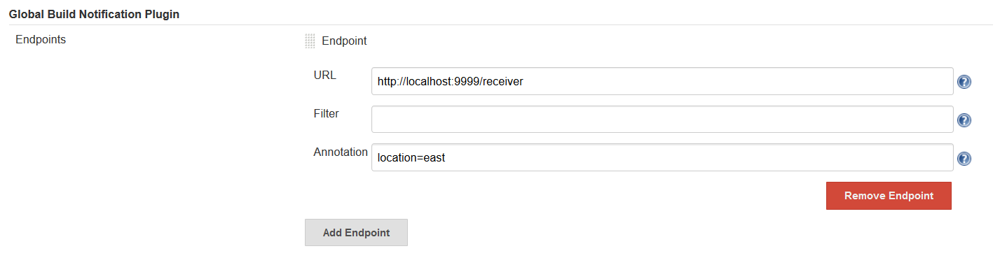

# Global Build Notification Plugin

[](https://www.travis-ci.org/anxk/global-build-notification-plugin)

This plugin adds the function to send every build event(STARTED and COMPLETED) of Jenkins to HTTP Endpoint.

## Installation

Clone this repo on your disk, navigate into folder `global-build-notification-plugin` and run command `mvn verify`, when it completed, upload `target/global-build-notification.hpi` to the update center of Jenkins and install it.

Also you can download `global-build-notification.hpi` from [release page](https://github.com/anxk/global-build-notification-plugin/releases), then upload it to the update center of Jenkins.

### Configuration

Go to manage > configure > Global Build Notification Plugin, add a http endpoint by specifying its URL, Filter (regular expression to restrict the job by full name) and annotation, for example:

<p align="center">
	
	<p align="center">
		<em>Configuration Example</em>
	</p>
</p>

If you configure the plugin just as the example above, when a build in Jenkins completed (or started), you will receive messages from the endpoint like this:

```json
{
    "duration": 75,
    "jobName": "test",
    "result": "SUCCESS",
    "eventId": "810e81f7-0a09-4d10-9130-134c6db95184",
    "causes": "Started by user admin",
    "eventType": "completed",
    "parameters": {
        "param1": "xxx",
        "param2": "yyy"
    },
    "url": "http://localhost:9090/job/test/5/",
    "timestamp": 1573581381138,
    "annotation": {
        "location": "east"
    }
}
```