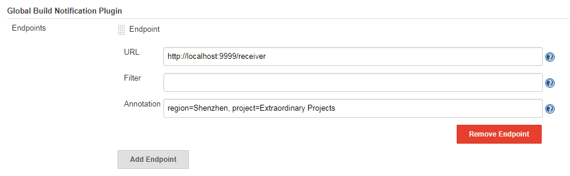

# global-build-notification-plugin

这个插件能够将Jenkins中发生的所有构建事件发送到指定的 HTTP Endpoint。

## 配置方法

这个插件的配置需要Jenkins管理员权限，导航到系统管理 > 系统设置 > Global Build Notification Plugin 的位置，通过 Add Endpoint 添加一个接收构建事件消息的 HTTP Endpoint，配置该 Endpoint 的 URL、Filter 和 Annotation 即可。其中 URL 是接收消息的有效 HTTP URL，例如：`http://localhost:9999/receiver`，Filter 是一个Java正则表达式，用来过滤构建的任务名，通常不需要配置该项，这意味着发生在 Jenkins 中的每个构建事件都会被接收到，Annotation 可用来给发送到该URL的消息添加额外的信息。例如：

<p align="center">
	
	<p align="center">
		<em>配置示例</em>
	</p>
</p>

按照上图配置后，假如触发了一个全名为 test 的任务，那么构建完成后在 `http://localhost:9999/receiver` 端会收到类似下面的消息：
```json
{
    "HDuration": "2.7 sec",
    "causes": "Started by user anonymous",
    "duration": 2758,
    "eventId": "f797f1d6-3b30-4c01-80bb-1d7e46ac8f24",
    "jobName": "test",
    "result": "SUCCESS",
    "timestamp": 1572102686886,
    "url": "http://localhost:8080/jenkins/job/test/32/",
    "annotation": {
        "region": "Shenzhen",
        "project": "Extraordinary Projects"
    }
}
```
